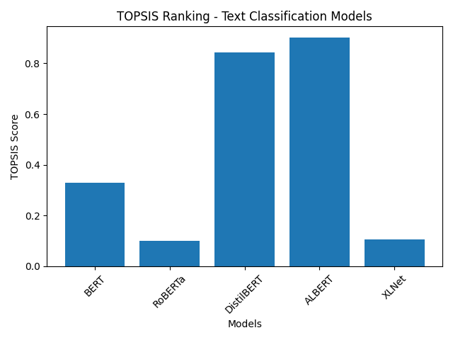

# 📊 Text Classification Model Selection using TOPSIS

## 📖 Project Overview

This project applies the **TOPSIS (Technique for Order of Preference by Similarity to Ideal Solution)** method to rank multiple pre-trained transformer models for **Text Classification**.

The objective is to select the most suitable model by considering both:

- 📈 Performance Metrics
- ⚙️ Computational Efficiency

Instead of selecting a model purely based on accuracy, this approach ensures a balanced and objective decision.

---

## 🤖 Models Evaluated

The following models were compared:

- BERT
- RoBERTa
- DistilBERT
- ALBERT
- XLNet

---

## 📊 Evaluation Criteria

| Criterion | Type |
|------------|------|
| Accuracy | Benefit (+) |
| F1 Score | Benefit (+) |
| Precision | Benefit (+) |
| Recall | Benefit (+) |
| Model Size | Cost (-) |
| Inference Time | Cost (-) |

- **Benefit Criteria** → Higher is better  
- **Cost Criteria** → Lower is better  

---

## ⚖️ Weights Used

All criteria were assigned equal weights:

[1, 1, 1, 1, 1, 1]

After normalization, each criterion contributes equally to the final ranking.

---

## 🧮 TOPSIS Methodology

The following steps were implemented:

1. Constructed the decision matrix.
2. Applied vector normalization.
3. Multiplied normalized matrix with weights.
4. Determined Ideal Best and Ideal Worst solutions.
5. Calculated Euclidean distances.
6. Computed TOPSIS score.
7. Ranked models based on closeness to ideal solution.

---

## 📈 Results

The output file `result.csv` contains:

- TOPSIS Score
- Final Rank

Higher TOPSIS score indicates better overall performance.

---

## 📊 Visualization

### 🔹 TOPSIS Ranking Graph

> The bar chart above shows the TOPSIS score comparison among evaluated models.

---

## 🏆 Key Insights

- Smaller and faster models performed competitively.
- High accuracy alone does not guarantee top rank.
- Balanced performance across all criteria leads to better ranking.

---

## 🛠 Tools Used

- Python
- NumPy
- Pandas
- Matplotlib

---

## 📂 Project Structure

Assignment-Topsis-TextClassification/
│
├── data.csv
├── topsis.py
├── result.csv
├── graph.png
└── README.md

---

## ✅ Conclusion

This project demonstrates how multi-criteria decision-making techniques like TOPSIS can be effectively used for selecting optimal machine learning models in practical deployment scenarios.
